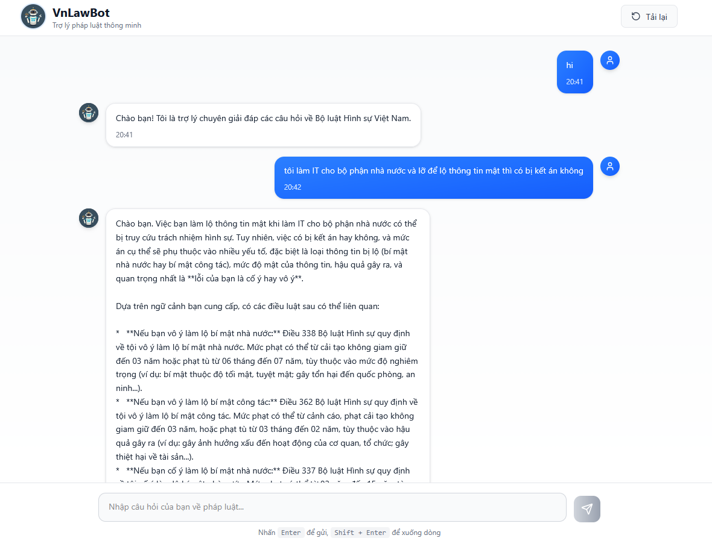

# Vietnam Criminal Law Chatbot

Chatbot hỏi đáp về luật hình sự tại Việt Nam sử dụng RAG (Retrieval-Augmented Generation) model.

## 🚀 Demo




- **Frontend**: [https://vn-law-bot-hoanglvuits-projects.vercel.app](https://vn-law-bot-hoanglvuits-projects.vercel.app)
- **Backend API**: [https://vnlawbot.hoanglvuit.id.vn](https://vnlawbot.hoanglvuit.id.vn)

## 🏗️ Kiến trúc hệ thống

### RAG Model (AI Core)
- **Framework**: LangChain
- **Tài liệu**: Bộ luật hình sự Việt Nam 2015
- **Embedding Model**: gemini-embedding-exp-03-07
- **LLM Model**: gemini-2.0-flash

### Technology Stack
- **Backend**: FastAPI
- **Frontend**: Tailwind CSS + Vite

## 🌐 Deployment Journey

### Frontend Deployment
- **Platform**: Vercel (Free tier)
- **URL**: https://vn-law-bot-hoanglvuits-projects.vercel.app

### Backend Deployment Evolution

#### 1. Railway (Initial Attempt)
- **Platform**: Railway free-tier
- **Issue**: Auto sleep - service không hoạt động liên tục

#### 2. VPS Solution
- **Platform**: VPS với Docker
- **Public IP**: 31.97.51.25
- **Port Mapping**: 2824:8000 (2824 là cổng VPS nhận request, 8000 là cổng container)
- **Access**: http://31.97.51.25:2824

### 🚨 Mixed Content Problem & Solution

#### Vấn đề phát sinh:
- Frontend được deploy trên Vercel tạo ra HTTPS URL: `https://vn-law-bot-hoanglvuits-projects.vercel.app`
- Backend chỉ có HTTP: `http://31.97.51.25:2824`
- **Mixed Content Error**: Frontend HTTPS không thể fetch data từ backend HTTP

#### Giải pháp thực hiện:

**Bước 1: Mua domain**
- Domain: `hoanglvuit.id.vn` (miễn phí)

**Bước 2: Cấu hình subdomain**
- Tạo DNS record: `vnlawbot.hoanglvuit.id.vn` → `31.97.51.25`

**Bước 3: SSL Setup với Nginx**
- Sử dụng Nginx làm reverse proxy
- Cung cấp chứng chỉ SSL cho domain `vnlawbot.hoanglvuit.id.vn`
- Enable HTTPS access

**Kết quả:**
- Backend có thể truy cập qua HTTPS: `https://vnlawbot.hoanglvuit.id.vn`
- Frontend có thể fetch data thành công

**Lưu ý phải cấu hình CORSMiddleware trong FastAPI cho phép domain Vercel**

## 🚀 CI/CD với Jenkins

### Tại sao chọn Jenkins?

- Tự động quy trình deploy 
- Nhưng không muốn mỗi lần push code là auto deploy -> không dùng GitHub webhook, chỉ deploy khi cần thiết bằng cách nhấn "Build Now"

### Jenkins Setup Process

#### 1. Local Jenkins Container
```bash
# Chạy Jenkins container với Docker daemon mount
# Port: localhost:8080
```

#### 2. Jenkins Configuration
- **Plugins**: Cài đặt các plugin cần thiết
- **Credentials Setup**:
  - `docker-hub`: Push image lên Docker Hub
  - `vps-hoanglv`: SSH key để đăng nhập VPS
  - `langsmith-api-key`: API key cho LangSmith
  - `gemini-api-key`: API key cho Gemini

#### 3. Automated Pipeline
**Jenkinsfile thực hiện:**
1. Clone repo từ GitHub
2. CD vào backend directory
3. Build Docker image
4. Push image lên Docker Hub
5. SSH vào VPS
6. Pull image mới
7. Run container mới

**Workflow:**
```
Manual "Build Now" → Jenkins đọc Jenkinsfile → 
Clone repo → Build & Push Image → Deploy to VPS
```

## 🎯 Key Learnings

### Problem Solving Process
1. **Railway Limitation**: Free tier auto sleep → Chuyển sang VPS
2. **Mixed Content Issue**: HTTP/HTTPS conflict → Domain + SSL solution
3. **Manual Deployment**: Tốn thời gian → Jenkins automation

### Deployment Strategy
- **Frontend**: Static deployment trên Vercel (free, reliable)
- **Backend**: VPS với Docker (full control, always-on)
- **Domain**: Free domain với SSL certificate
- **CI/CD**: Jenkins cho controlled deployment

## 🛠️ Technical Architecture

```
User → Frontend (Vercel HTTPS) → Backend (VPS + Nginx SSL) → 
RAG Model (LangChain + Gemini) → Vietnam Criminal Law Database
```

## 🗓️ Update 17-10-2025 — Triển khai VN LawBot Backend thủ công trên AWS EC2

Vì Jenkins gặp sự cố nên lần này tiến hành **triển khai thủ công (manual deploy)** bằng Docker trên **AWS EC2**.

---

### 🚀 1. Tạo EC2 instance

1. **Loại máy:** `t2.micro` (Free tier)
2. **Hệ điều hành:** Ubuntu (22.04 hoặc mới hơn)
3. **Tạo Key Pair:** để SSH vào máy, ví dụ `lawbot.pem`
4. **Security Group:**
   - Mở inbound rule cho các port:
     - `80` (HTTP)
     - `443` (HTTPS)
     - `2824` (TCP – backend app)

---

### 🔑 2. SSH vào EC2
```bash
ssh -i lawbot.pem ubuntu@
```

---

### 🐳 3. Cài đặt Docker
```bash
sudo apt update -y
sudo apt install docker.io -y
sudo systemctl enable docker
sudo systemctl start docker
```

---

### 🧠 4. Clone source code & build Docker image
```bash
git clone https://github.com/hoanglvuit/VN-LawBot.git
cd ~/VN-LawBot/backend
```

Build image:
```bash
docker build -t hoanglvuitm/vnlawbot:latest .
```

---

### ⚙️ 5. Chạy backend container

Dùng các biến môi trường (`-e`) để truyền key:
```bash
docker run -d \
  -p 2824:8000 \
  --name vnlawbot \
  -e LANGSMITH_API_KEY="lsv2_..." \
  -e GEMINI_API_KEY="AIza..." \
  hoanglvuitm/vnlawbot:latest
```

Kiểm tra log:
```bash
docker logs -f vnlawbot
```

Nếu thấy `Uvicorn running on http://0.0.0.0:8000` là backend đã chạy thành công ✅

---

### 🌐 6. Cấu hình domain

- Trỏ subdomain `vnlawbot.hoanglvuit.id.vn` (qua access.pavietnam.vn) về Public IP của EC2.
- Dùng dnschecker.org để xác minh.

---

### 🔒 7. Cài đặt SSL bằng Certbot

Certbot chỉ cần chạy một lần để lấy chứng chỉ ban đầu.
```bash
sudo apt install certbot -y
sudo mkdir -p ~/certbot
sudo certbot certonly --webroot -w ~/certbot -d vnlawbot.hoanglvuit.id.vn
```

Sau khi thành công, chứng chỉ sẽ nằm tại:
```
/etc/letsencrypt/live/vnlawbot.hoanglvuit.id.vn/
```

---

### 🧱 8. Cấu hình Nginx reverse proxy

Tạo thư mục và file config:
```bash
mkdir -p ~/nginx/conf.d
cd ~/nginx
sudo nano conf.d/default.conf
```

Nội dung file:
```nginx
server {
    listen 80;
    server_name vnlawbot.hoanglvuit.id.vn;
    location /.well-known/acme-challenge/ {
        root /var/www/certbot;
    }
    location / {
        return 301 https://$host$request_uri;
    }
}

server {
    listen 443 ssl;
    server_name vnlawbot.hoanglvuit.id.vn;
    ssl_certificate /etc/letsencrypt/live/vnlawbot.hoanglvuit.id.vn/fullchain.pem;
    ssl_certificate_key /etc/letsencrypt/live/vnlawbot.hoanglvuit.id.vn/privkey.pem;
    location / {
        proxy_pass http://vnlawbot:8000;
        proxy_set_header Host $host;
        proxy_set_header X-Real-IP $remote_addr;
    }
}
```

---

### 🌍 9. Chạy Nginx container
```bash
docker run -d \
  --name nginx_proxy \
  --network bridge \
  -p 80:80 -p 443:443 \
  -v ~/nginx/conf.d:/etc/nginx/conf.d \
  -v ~/certbot:/var/www/certbot \
  -v /etc/letsencrypt:/etc/letsencrypt:ro \
  nginx:latest
```

Kiểm tra log:
```bash
docker logs -f nginx_proxy
```

Nếu không có lỗi "cannot load certificate" thì SSL đã hoạt động.

---

### ✅ 10. Kiểm tra cuối

Truy cập:
```
https://vnlawbot.hoanglvuit.id.vn
```

Nếu truy cập thành công → setup hoàn chỉnh 🎉

---

### 🔁 11. Gia hạn chứng chỉ (tự động & miễn phí)

Certbot của Let's Encrypt là 100% free.

Bạn có thể kiểm tra gia hạn thủ công:
```bash
sudo certbot renew --dry-run
```

Nếu thấy:
```
Congratulations, all renewals succeeded
```

→ chứng chỉ có thể tự động gia hạn được ✅


*Dự án được phát triển nhằm mục đích học tập và hỗ trợ tra cứu luật hình sự Việt Nam.*