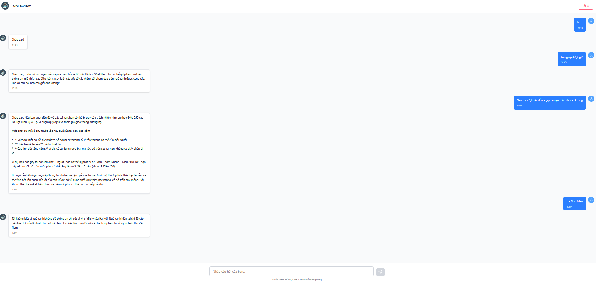

# Vietnam Criminal Law Chatbot

Chatbot hỏi đáp về luật hình sự tại Việt Nam sử dụng RAG (Retrieval-Augmented Generation) model. Hãy mô tả tình huống chatbot sẽ đánh giá xem tình huống của bạn có vi phạm luật hình sự Việt Nam không (dựa trên bộ luật hình sự 2015)

## 🚀 Demo



- **Frontend**: [https://vn-law-bot-hoanglvuits-projects.vercel.app](https://vn-law-bot-hoanglvuits-projects.vercel.app)
- **Backend API**: [https://vnlawbot.hoanglvuit.id.vn](https://vnlawbot.hoanglvuit.id.vn)

## 🏗️ Kiến trúc hệ thống

### RAG Model (AI Core)
- **Framework**: LangChain + LangGraph
- **Tài liệu**: Bộ luật hình sự Việt Nam 2015
- **Embedding Model**: `gemini-embedding-exp-03-07`
- **LLM Model**: `gemini-2.0-flash`
- **Vector Database**: ChromaDB

### Technology Stack
- **Backend**: FastAPI
- **Frontend**: Tailwind CSS + Vite
- **Deployment**: 
  - Frontend: Vercel (Free tier)
  - Backend: VPS với Docker + Nginx + SSL

## 📊 Tạo Vector Store (Database)

Vector store là cơ sở dữ liệu chứa embeddings của các điều luật, được sử dụng để tìm kiếm ngữ cảnh liên quan khi người dùng đặt câu hỏi.

### Bước 1: Xử lý dữ liệu (Data Processing)

File `backend/data/processing.py` thực hiện:
- Đọc PDF từ `backend/data/raw/law_vn.pdf`
- Loại bỏ tiêu đề và các chương không cần thiết
- Chunking theo từng điều luật (pattern: `Điều \d+\.`)
- Lưu kết quả vào `backend/data/processed/chuking.json`

```bash
cd backend/data
python processing.py
```

### Bước 2: Tạo Embeddings và Vector Store

File `backend/embedding.py` thực hiện:
- Load chunks từ `chuking.json`
- Sử dụng Gemini Embedding model để tạo vector embeddings
- Lưu vào ChromaDB tại `backend/database/` (hoặc `backend/vector_store/`)

```bash
cd backend
python embedding.py
```

**Lưu ý**: 
- Script có rate limiting (sleep 59s sau mỗi 10 documents) để tránh vượt quota API
- Cần set `GEMINI_API_KEY` và `LANGSMITH_API_KEY` trong `.env`
- Vector store sẽ được persist và sử dụng trong RAG pipeline

### Cấu trúc thư mục

```
backend/
├── data/
│   ├── raw/
│   │   └── law_vn.pdf          # PDF gốc
│   ├── processed/
│   │   └── chuking.json        # Chunks sau khi xử lý
│   └── processing.py           # Script xử lý PDF
├── embedding.py                 # Script tạo embeddings
├── database/                    # ChromaDB vector store (sau khi chạy embedding.py)
└── app/
    └── rag.py                   # RAG pipeline sử dụng vector store
```

## 🚀 Deployment

### Frontend Deployment
- **Platform**: Vercel (Free tier)
- **URL**: https://vn-law-bot-hoanglvuits-projects.vercel.app

### Backend Deployment

#### VPS Setup với Docker + Nginx + SSL

**Yêu cầu:**
- VPS với Ubuntu 22.04+
- Domain đã trỏ về IP VPS
- Docker và Docker Compose đã cài đặt

**Các bước triển khai:**

1. **Clone repository và build image:**
```bash
git clone https://github.com/hoanglvuit/VN-LawBot.git
cd VN-LawBot/backend
docker build -t hoanglvuitm/vnlawbot:latest .
```

2. **Cấp chứng chỉ SSL (Let's Encrypt):**
```bash
docker run -it --rm \
  -v $(pwd)/certbot:/etc/letsencrypt \
  -p 80:80 \
  certbot/certbot certonly --standalone \
  -d vnlawbot.hoanglvuit.id.vn
```

3. **Cấu hình Nginx Reverse Proxy:**

Tạo file `~/nginx/conf.d/default.conf`:
```nginx
# Redirect HTTP → HTTPS
server {
    listen 80;
    server_name vnlawbot.hoanglvuit.id.vn;
    return 301 https://$host$request_uri;
}

# HTTPS Config
server {
    listen 443 ssl;
    server_name vnlawbot.hoanglvuit.id.vn;

    ssl_certificate /etc/letsencrypt/live/vnlawbot.hoanglvuit.id.vn/fullchain.pem;
    ssl_certificate_key /etc/letsencrypt/live/vnlawbot.hoanglvuit.id.vn/privkey.pem;

    location / {
        proxy_pass http://vnlawbot:8000;
        proxy_set_header Host $host;
        proxy_set_header X-Real-IP $remote_addr;
    }
}
```

4. **Docker Compose:**

File `~/nginx/docker-compose.yml`:
```yaml
version: '3.8'

services:
  vnlawbot:
    image: hoanglvuitm/vnlawbot:latest
    container_name: vnlawbot
    ports:
      - "2824:8000"
    environment:
      - LANGSMITH_API_KEY=lsv2_...
      - GEMINI_API_KEY=AIza...
    restart: always

  nginx_proxy:
    image: nginx:latest
    container_name: nginx_proxy
    depends_on:
      - vnlawbot
    ports:
      - "80:80"
      - "443:443"
    volumes:
      - ./conf.d:/etc/nginx/conf.d
      - /home/ubuntu/certbot:/etc/letsencrypt
    restart: always
```

5. **Chạy services:**
```bash
cd ~/nginx
sudo docker compose up -d
```

## 🔄 CI/CD với Jenkins

### Setup Jenkins

Jenkins được sử dụng để tự động hóa quá trình deploy khi cần thiết (manual trigger, không dùng webhook).

**Jenkinsfile thực hiện:**
1. Clone repo từ GitHub
2. Build Docker image
3. Push image lên Docker Hub
4. SSH vào VPS
5. Pull image mới và restart container

**Workflow:**
```
Manual "Build Now" → Jenkins đọc Jenkinsfile → 
Clone repo → Build & Push Image → Deploy to VPS
```

**Credentials cần thiết:**
- `docker-hub`: Push image lên Docker Hub
- `vps-hoanglv`: SSH key để đăng nhập VPS
- `langsmith-api-key`: API key cho LangSmith
- `gemini-api-key`: API key cho Gemini

## 🛠️ Technical Architecture

```
User → Frontend (Vercel HTTPS) 
    → Backend (VPS + Nginx SSL) 
    → RAG Model (LangChain + Gemini) 
    → Vector Store (ChromaDB) 
    → Vietnam Criminal Law Database
```

## 📝 Environment Variables

Tạo file `.env` trong thư mục `backend/`:

```env
GEMINI_API_KEY=your_gemini_api_key
LANGSMITH_API_KEY=your_langsmith_api_key
```

## 🎯 Key Features

- **RAG Pipeline**: Retrieval-Augmented Generation với LangGraph
- **Semantic Search**: Tìm kiếm ngữ cảnh liên quan bằng vector embeddings
- **Vietnamese Law Database**: Hỗ trợ tra cứu Bộ luật Hình sự Việt Nam 2015
- **HTTPS Support**: SSL certificate với Let's Encrypt
- **CI/CD**: Automated deployment với Jenkins

---

*Dự án được phát triển nhằm mục đích học tập và hỗ trợ tra cứu luật hình sự Việt Nam.*
